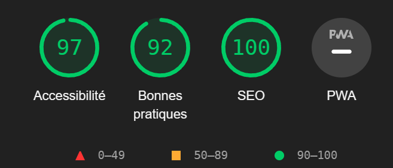

#**Refont web : développement** 🚀 

>Premièrement on remarque que l'attribut **lang** est En qui convient pour les pages redigées en Anglais or les contenus de notre site sont redigés en français donc je change la valeur de cette attribut en "fr" pour prendre en compte la langue

**Ensuite les erreurs dans le code html**
>Ajouter un entête qui va contenir toute la navigation

>Ensuite pour une meilleure lecture et à des fins de facilté de distinctions on doit faire fit des balises *div* et les remplacer par des balises sémantiques telles que *section*, *main* ou *article*

>Aussi le problème au niveau des balises fermantes qui sont de trop ou mal placés, on les rectifie notament la balise */a* au niveau de **Sign up Here**

**Erreur lors de la validation**
>D'abord faut regler le problème du placement de *button* et *a* en effet l'un ne peut descendre de l'autre et vice versa.
comme solution on peut mettre dans l'element *a* une balise et l'appliquer un style de btn et si on veut un button contenant un lien le mieux serait de faire un petit form avec pour valeur de l'attribut action le lien vers lequel doit nous diriger le btn

>l'attribut name des elements input est vide or ça ne doit pas être le cas elle doit contenir une valeur si on a pas de valeur on peut soit mettre un **#** à la place afin que le code soit valide

***Resultat du lighthouse***

>On remarque que après nos modificatons l'indicateur SEO est à 100

>Aussi il ya toujours des problèmes d'accessibilités qui persistent au fait des constrates dans les couleurs etc il faudrait ajuster les couleurs et bien les nuancer, aussi l'ajout de l'élément *label* après les éléments inputs de type *password* , *text* , 

>Anfin concernant les bonnes pratiques ce qui est recommandé c'est de sécuriser le site en utilisant le protocole **https**

***Conversion px to rem***
>Mise en place dans la pseudo class *:root* de la valeur de base **1rem = 10 px**

>Ensuite procéder au calcul à chaque utilisation de l'unité pixel pour avoir la valeur en rem